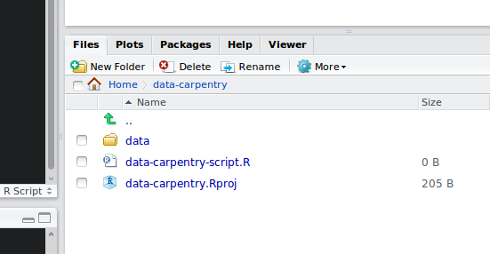

# Data Carpentry R materials - Before we start

--------------------------------------------------

# Objectives

* Articulating motivations for this lesson
* Introduce participants to the RStudio interface
* Set up participants to have a working directory with a data/ folder inside
* Introduce R syntax
* Point to relevant information on how to get help, and understand how to ask
  well formulated questions

----------------------------------------------------

# Motivations for the R lesson

* Its really important that you know what you did. More journals/grants/etc. are
  also making it important for them to know what you did.
* A lot of scientific code is NOT reproducible.
* If you keep a lab notebook, why are we not as careful with our code.
* We edit each others manuscripts, but we don't edit each other's code.
* If you write your code with "future you" in mind, you will save yourself and
  others a lot of time.

# Before we get started

* Start RStudio (presentation of RStudio -above- should happen here)
* Under the `File` menu, click on `New project`, choose `New directory`, then
  `Empty project`
* Enter a name for this new folder, and choose a convenient location for
  it. This will be your **working directory** for the rest of the day
  (e.g., `~/data-carpentry`)
* Click on "Create project"
* Under the `Files` tab on the right of the screen, click on `New Folder` and
  create a folder named `data` within your newly created working directory.
  (e.g., `~/data-carpentry/data`)
* Create a new R script (File > New File > R script) and save it in your working
  directory (e.g. `data-carpentry-script.R`)

Your working directory should now look like this:



# Presentation of RStudio

Let's start by learning about our tool.

_Point out the different windows in R._

* Console, Scripts, Environments, Plots
* Avoid using shortcuts.
* Code and workflow is more reproducible if we can document everything that we
  do.
* Our end goal is not just to "do stuff" but to do it in a way that anyone can
  easily and exactly replicate our workflow and results.

# Basics of R

R is a versatile, open source programming/scripting language that's useful both
for statistics but also data science. Inspired by the programming language S.

* Open source software under GPL.
* Superior (if not just comparable) to commercial alternatives. R has over 5,000
  user contributed packages at this time. It's widely used both in academia and
  industry.
* Available on all platforms.
* Not just for statistics, but also general purpose programming.
* Is object oriented and functional.
* Large and growing community of peers.

## Commenting

Use `#` signs to comment. Comment liberally in your R scripts. Anything to the
right of a `#` is ignored by R.

## Assignment operator

`<-` is the assignment operator. Assigns values on the right to objects on the
left. Mostly similar to `=` but not always. Learn to use `<-` as it is good
programming practice. Using `=` in place of `<-` can lead to issues down the
line.

`=` should only be used to specify the values of arguments in functions for
instance `read.csv(file="data/some_data.csv")`.

## Good practices

There are two main ways of interacting with R: using the console or by using
script files (plain text files that contain your code).

The recommended approach when working on a data analysis project is dubbed "the
source code is real". The objects you are creating should be seen as disposable
as they are the direct realization of your code. Every object in your analysis
can be recreated from your code, and all steps are documented. Therefore, it is
best to enter as little commands as possible in the R console. Instead, all code
should be written in script files, and evaluated from there. The R console
should be used to inspect objects, test a function or get help. With this
approach, the `.Rhistory` file automatically created during your session should
not be very useful.

Similarly, you should separate the original data (raw data) from intermediate
datasets that you may create for the need of a particular analysis. For
instance, you may want to create a `data/` directory within your working
directory that stores the raw data, and have a `data_output/` directory for
intermediate datasets and a `figure_output/` directory for the plots you will
generate.

## Seeking help

### I know the name of the function I want to use, but I'm not sure how to use it

If you need help with a specific function, let's say `barplot()`, you can type:


```r
?barplot
```

If you just need to remind yourself of the names of the arguments, you can use:


```r
args(lm)
```

If the function is part of a package that is installed on your computer but
don't remember which one, you can type


```r
??read.dna
```

### I want to use a function that does X, there must be a function or it but I don't know which one...

If you are looking for a function to do a particular task, you can use
`help.search()` (but only looks through the installed packages):


```r
help.search("kruskal")
```

If you can't find what you are looking for, you can use the
[rdocumention.org](http://www.rdocumentation.org) website that search through
the help files across all packages available.

### I am stuck... I get an error message that I don't understand

Start by googling the error message. However, this doesn't always work very well
because often, package developers rely too much on the error catching provided
by R. You end up with general error messages that might not be very helpful to
diagnose a problem (e.g. "subscript out of bounds").

However, you should check stackoverflow. Search using the `[r]` tag. Most
questions have already been answered, but the challenge is to use the right
words in the search to find the answers:
[http://stackoverflow.com/questions/tagged/r](http://stackoverflow.com/questions/tagged/r)

The [Introduction to R](http://cran.r-project.org/doc/manuals/R-intro.pdf) can
also be dense for people with little programming experience but it is a good
place to understand

The [R FAQ](http://cran.r-project.org/doc/FAQ/R-FAQ.html) is dense and technical
but it is full of useful information.

### Asking for help

The key to get help from someone is for them to grasp your problem rapidly. You
should make it as easy as possible for them to pinpoint where the issue might
be.

Try to use the correct words to describe your problem. For instance, a package
is not the same thing as a library. Most people will understand what you meant,
but others have really strong feelings about the difference in meaning. The key
point is that it can make things confusing for people trying to help you. Be be
as precise as possible when describing your problem

If possible, try to reduce what doesn't work to a simple reproducible
example. If you can reproduce the problem using a very small `data.frame`
instead of your 50,000 rows and 10,000 columns one, provide the small one with
the description of your problem. When appropriate, try to generalize what you
are doing so even people who are not in your field can understand the question.

To share an object with someone else, if it's relatively small, you can use the
function `dput()`, it will output R code that can be used to recreate the exact same
object as the one in memory:


```r
dput(head(iris)) # iris is an example data.frame that comes with R
```

```
## structure(list(Sepal.Length = c(5.1, 4.9, 4.7, 4.6, 5, 5.4), 
##     Sepal.Width = c(3.5, 3, 3.2, 3.1, 3.6, 3.9), Petal.Length = c(1.4, 
##     1.4, 1.3, 1.5, 1.4, 1.7), Petal.Width = c(0.2, 0.2, 0.2, 
##     0.2, 0.2, 0.4), Species = structure(c(1L, 1L, 1L, 1L, 1L, 
##     1L), .Label = c("setosa", "versicolor", "virginica"), class = "factor")), .Names = c("Sepal.Length", 
## "Sepal.Width", "Petal.Length", "Petal.Width", "Species"), row.names = c(NA, 
## 6L), class = "data.frame")
```

If the object is larger, provide either the raw file (i.e., your CSV file) with
your script up to the point of the error (and after removing everything that is
not relevant to your issue). Alternatively, in particular if your questions is
not related to a `data.frame`, you can save any R object to a file:


```r
saveRDS(iris, file="/tmp/iris.rds")
```

The content of this file is however not human readable and cannot be posted
directly on stackoverflow. It can how be sent to someone by email who can read
it with this command:


```r
some_data <- readRDS(file="~/Downloads/iris.rds")
```

Last, but certainly not least, **always include the output of `sessionInfo()`**
as it provides critical information about your platform, the versions of R and
the packages that you are using, and other information that can be very helpful
to understand your problem.


```r
sessionInfo()
```

```
## R version 3.1.1 (2014-07-10)
## Platform: x86_64-pc-linux-gnu (64-bit)
## 
## locale:
##  [1] LC_CTYPE=en_US.UTF-8       LC_NUMERIC=C              
##  [3] LC_TIME=en_US.UTF-8        LC_COLLATE=en_US.UTF-8    
##  [5] LC_MONETARY=en_US.UTF-8    LC_MESSAGES=en_US.UTF-8   
##  [7] LC_PAPER=en_US.UTF-8       LC_NAME=C                 
##  [9] LC_ADDRESS=C               LC_TELEPHONE=C            
## [11] LC_MEASUREMENT=en_US.UTF-8 LC_IDENTIFICATION=C       
## 
## attached base packages:
## [1] grid      stats     graphics  grDevices utils     datasets  methods  
## [8] base     
## 
## other attached packages:
## [1] knitr_1.6      devtools_1.6   fortunes_1.5-2
## 
## loaded via a namespace (and not attached):
## [1] compiler_3.1.1 evaluate_0.5.5 formatR_1.0    markdown_0.7.4
## [5] mime_0.1.2     stringr_0.6.2  tools_3.1.1
```

### Where to ask for help?

* Your friendly colleagues: if you know someone with more experience than you,
  they might be able and willing to help you.
* Stackoverlow: if your question hasn't been answered before and is well
  crafted, chances are you will get an answer in less than 5 min.
* The [R-help](https://stat.ethz.ch/mailman/listinfo/r-help): it is read by a
  lot of people (including most of the R core team), a lot of people post to it,
  but the tone can be pretty dry, and it is not always very welcoming to new
  users. If your question is valid, you are likely to get an answer very fast
  but don't expect that it will come with smiley faces. Also here more than
  everywhere else, be sure to use correct vocabulary (otherwise you might get an
  answer pointing to the misuse of your words rather than answering your
  question). You will also have more success if your question is about a base
  function rather than a specific package.
* If your question is about a specific package, see if there is a mailing list
  for it. Usually it's included in the DESCRIPTION file of the package that can
  be accessed using `packageDescription("name-of-package")`. You may also want
  to try to email the author of the package directly.
* There are also some topic-specific mailing lists (GIS, phylogenetics, etc...),
  the complete list is [here](http://www.r-project.org/mail.html).

### More resources

* The [Posting Guide](http://www.r-project.org/posting-guide.html) for the R
  mailing lists.
* [How to ask for R help](http://blog.revolutionanalytics.com/2014/01/how-to-ask-for-r-help.html)
  useful guidelines
