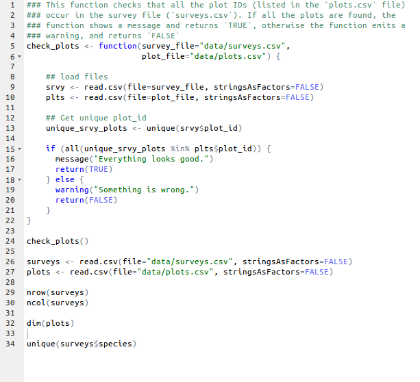
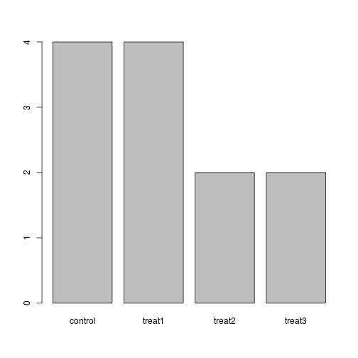
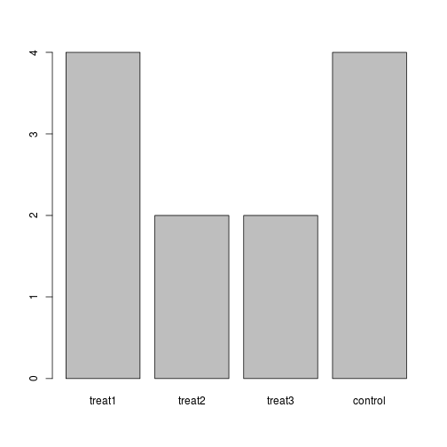

# Data Carpentry R materials -- Introduction to R

--------------------------------------------------

## Objectives

* Familiarize participants with R syntax
* Understand the concepts of objects and assignment
* Understand the concepts of vector and data types
* Understand how factors work
* Get exposed to a few functions

---------------------------------------------------

## The R syntax

_Start by showing an example of a script_

* Point to the different parts:
  - a function
  - the assignment operator `<-`
  - the `=` for arguments
  - the comments `#` and how they are used to document function and its content
  - the `$` operator
* Point to identation and consistency in spacing to improve clarity



## Creating objects


You can get output from R simply by typing in math in the console


```r
3 + 5
12/7
```

However, to do useful and interesting things, we need to assign _values_ to
_objects_. To create objects, we need to give it a name followed by the
assignment operator `<-` and the value we want to give it:


```r
weight_kg <- 55
```

Objects can be given any name such as `x`, `current_temperature`, or
`subject_id`. You want your object names to be explicit and not too long. They
cannot start with a number (`2x` is not valid but `x2` is). R is case sensitive
(e.g., `weight_kg` is different from `Weight_kg`). There are some names that
cannot be used because they represent the names of fundamental functions in R
(e.g., `if`, `else`, `for`, see
[here](https://stat.ethz.ch/R-manual/R-devel/library/base/html/Reserved.html)
for a complete list). In general, even if it's allowed, it's best to not use
other function names (e.g., `c`, `T`, `mean`, `data`, `df`, `weights`). In doubt
check the help to see if the name is already in use. It's also best to avoid
dots (`.`) within a variable name as in `my.dataset`. It is also recommended to
use nouns for variable names, and verbs for function names.

When assigning a value to an object, R does not print anything. You can force to
print the value by using parentheses or by typing the name:


```r
(weight_kg <- 55)
weight_kg
```

Now that R has `weight_kg` in memory, we can do arithmetic with it. For
instance, we may want to convert this weight in pounds (weight in pounds is 2.2
times the weight in kg):


```r
2.2 * weight_kg
```

We can also change a variable's value by assigning it a new one:


```r
weight_kg <- 57.5
2.2 * weight_kg
```

This means that assigning a value to one variable does not change the values of
other variables.  For example, let's store the animal's weight in pounds in a
variable.


```r
weight_lb <- 2.2 * weight_kg
```

and then change `weight_kg` to 100.


```r
weight_kg <- 100
```

What do you think is the current content of the object `weight_lb`? 126.5 or 200?

### Exercise

What are the values after each statement in the following?


```r
mass <- 47.5           # mass?
age  <- 122            # age?
mass <- mass * 2.0     # mass?
age  <- age - 20       # age?
massIndex <- mass/age  # massIndex?
```

## Vectors and data types


A vector is the most common and basic data structure in R, and is pretty much
the workhorse of R. It's a group of values, mainly either numbers or
characters. You can assign this list of values to a variable, just like you
would for one item. For example we can create a vector of animal weights:


```r
weights <- c(50, 60, 65, 82)
weights
```

A vector can also contain characters:


```r
animals <- c("mouse", "rat", "dog")
animals
```

There are many functions that allow you to inspect the content of a
vector. `length()` tells you how many elements are in a particular vector:


```r
length(weights)
length(animals)
```

`class()` indicates the class (the type of element) of an object:


```r
class(weights)
class(animals)
```

The function `str()` provides an overview of the object and the elements it
contains. It is a really useful function when working with large and complex
objects:


```r
str(weights)
str(animals)
```

You can add elements to your vector simply by using the `c()` function:


```r
weights <- c(weights, 90) # adding at the end
weights <- c(30, weights) # adding at the beginning
weights
```

What happens here is that we take the original vector `weights`, and we are
adding another item first to the end of the other ones, and then another item at
the beginning. We can do this over and over again to build a vector or a
dataset. As we program, this may be useful to autoupdate results that we are
collecting or calculating.

We just saw 2 of the 6 **data types** that R uses: `"character"` and
`"numeric"`. The other 4 are:
* `"logical"` for `TRUE` and `FALSE` (the boolean data type)
* `"integer"` for integer numbers (e.g., `2L`, the `L` indicates to R that it's an integer)
* `"complex"` to represent complex numbers with real and imaginary parts (e.g.,
  `1+4i`) and that's all we're going to say about them
* `"raw"` that we won't discuss further

Vectors are one of the many **data structures** that R uses. Other important
ones are lists (`list`), matrices (`matrix`), data frames (`data.frame`) and
factors (`factor`). They are all built using vectors. We will talk about
`data.frame` soon but first we need to learn about `factor`.

## Factors


Factors are special vectors that represent categorical data. Factors can be
ordered or unordered and are important for statistical analysis and for
plotting.

Factors are stored as integers that have labels associated the unique
integers. While factors look (and often behave) like character vectors, they are
actually integers under the hood, and you need to be careful when treating them
like strings.

Once created factors can only contain a pre-defined set values, known as
*levels*. By default, R always sorts *levels* in alphabetical order. For
instance, if you have a factor with 2 levels:


```r
sex <- factor(c("male", "female", "female", "male"))
```

R will assign `1` to the level `"female"` and `2` to the level `"male"` (because
`f` comes before `m`, even though the first element in this vector is
`"male"`). You can check this by using the function `levels()`, and check the
number of levels using `nlevels()`:


```r
levels(sex)
nlevels(sex)
```

Sometimes, the order of the factors does not matter, other times you might want
factors to be ordered, because the order is meaningful (e.g., low, medium,
high), or it is required by a particular type of analysis.


```r
food <- factor(c("low", "high", "medium", "high", "low", "medium", "high"))
levels(food)
food <- factor(food, levels=c("low", "medium", "high"), ordered=TRUE)
levels(food)
```

In R's memory, these vectors of factors are represented by numbers 1, 2, 3. They
are better than using simple integer labels because factors are what are called
self describing: `"male"` and `"female"`" is more descriptive than `1`s and
`2`s. Which is male? `1` or `2`? You wouldn't be able to tell with just integer
data. Factors have this information built in. It is particularly helpful when
there are many levels (like the species in our example data set), or when there
is no additional metadata (for simple datasets, real datasets always have
metadata, right?)

If you need to convert a factor to a character vector, simply use
`as.character(x)`.

Converting a factor to a numeric vector is however a little trickier, and you
have to go via a character vector. Compare:


```r
f <- factor(c(1, 5, 10, 2))
as.numeric(f) ## wrong! and there is no warning...
as.numeric(as.character(f))
```

### Exercise

The function `table()` tabulates observations and can be used to create
bar plots quickly. For instance:


```r
## Question: How can you recreate this plot but by having "control"
## being listed last instead of first?
exprmt <- factor(c("treat1", "treat2", "treat1", "treat3", "treat1", "control",
                   "control", "treat1", "treat2", "control", "treat3", "control"))
table(exprmt)
```

```
## exprmt
## control  treat1  treat2  treat3 
##       4       4       2       2
```

```r
barplot(table(exprmt))
```

 


<!---

```r
exprmt <- factor(exprmt, levels=c("treat1", "treat2", "treat3", "control"))
barplot(table(exprmt))
```

 
--->
